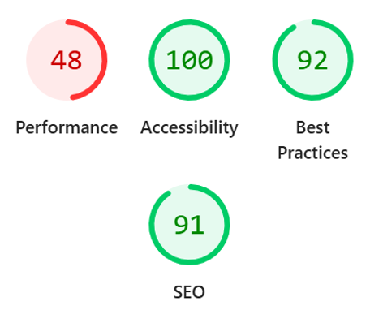
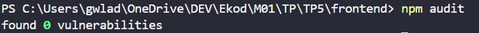

# TP5-Ekod

Mes tâches : gestion de tâches pour bénévoles  

Application web permettant à une association de suivre ses tâches et de savoir quel bénévole s'en occupe. Elle permet d'ajouter une tâche, de la marquer comme terminée, de la filtrer, de retirer le bénévole qui lui est associé, ou de la supprimer.  

Projet réalisé dans le cadre du TP5. L'interface est conçue pour être accessible (labels associés, navigation au clavier, annonces pour lecteurs d'écran, lien d'évitement).  

## Technologies :  
React + Vite  
ESLint  
API REST (backend séparé) 

## Installation :  
bash  
npm install  
npm install -D eslint-plugin-jsx-a11y --legacy-peer-deps   # si conflit de peer dependencies avec ESLint 10  

Créer un fichier .env à la racine du dossier frontend :  

VITE_API_URL=http://localhost:3000

(adapter l'URL à celle de ton API).  

## Commandes : 
Commande	--> Rôle
npm run dev	--> Lance le serveur de développement  
npm run build --> Génère la version de production  
npm run lint --> Analyse le code  

## Données de l'API

Chaque tâche contient :  

Champ --> Description  
id --> Identifiant de la tâche  
titre --> Titre de la tâche (obligatoire)  
assignee --> Prénom du bénévole assigné (facultatif)  
complété --> Indique si la tâche est terminée  

## Questions

### Pourquoi aucune variable `VITE_` ne contient de secret ?  
Vite injecte les variables préfixées `VITE_` dans le bundle JavaScript au moment
du build. Le code est ensuite envoyé au navigateur : n'importe qui peut le lire
(onglet Sources, outils de développement). Une variable `VITE_` est donc publique
par nature. Les secrets (mot de passe de la base, `DATABASE_URL`, clés d'API)
restent côté serveur, dans des variables d'environnement (Heroku Config Vars,
fichier `.env` ignoré par Git), et ne sont jamais préfixés `VITE_`.

### Pourquoi la validation du frontend ne suffit pas ?  
La validation côté client améliore l'expérience (retour immédiat à
l'utilisateur), mais elle est contournable : on peut modifier le code dans le
navigateur, désactiver le JavaScript ou appeler l'API directement (curl,
Postman) sans passer par l'interface. Le serveur ne doit donc jamais faire
confiance aux données reçues : il revalide tout (types, longueurs, formats) et
utilise des requêtes paramétrées pour se protéger des injections SQL.

### Pourquoi l'application n'a pas besoin de bandeau cookies ?  
L'application ne dépose aucun cookie ni traceur non essentiel : pas de
publicité, pas d'analytics, pas de suivi tiers. Le consentement n'est exigé que
pour ces traceurs. Les données strictement nécessaires au fonctionnement
(par exemple une session d'authentification) sont exemptées de consentement.
  
  
Protection des données personnelles  
  
Finalité  :  
Le prénom d'un bénévole est enregistré uniquement pour savoir qui s'occupe de quelle tâche au sein de l'association. Il n'est utilisé à aucune autre fin (pas de statistiques, de prospection ni de partage avec des tiers).  

Données collectées  
Le prénom (ou nom) du bénévole, saisi librement dans le champ « Nom du bénévole » (colonne assignee).
Aucune autre donnée personnelle n'est demandée : pas d'adresse e-mail, de téléphone ni de compte utilisateur.
Le champ est facultatif : une tâche peut être créée sans bénévole.
Durée de conservation

Le prénom est conservé tant que la tâche existe, et supprimé en même temps qu'elle. Il peut être effacé plus tôt à tout moment, via le bouton « Retirer le bénévole » ou sur demande du bénévole.

Accès aux données  
Les membres de l'association qui utilisent l'application (consultation et modification).
La ou les personnes qui administrent l'API et la base de données (accès technique).
Aucune transmission à des tiers.
Droits des bénévoles et exercice

Conformément au RGPD, chaque bénévole peut :  
accéder aux données qui le concernent ;  
faire rectifier son prénom s'il est erroné ;  
demander l'effacement de son prénom (droit à l'effacement) ;  
s'opposer au traitement ou en demander la limitation.  

Pour exercer ces droits, il suffit d'écrire à contact@association.example. La demande est traitée dans un délai maximum d'un mois. Un responsable de l'association peut aussi retirer immédiatement le prénom depuis l'application avec le bouton « Retirer le bénévole ». En cas de difficulté, une réclamation peut être adressée à la CNIL (www.cnil.fr).

