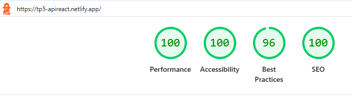
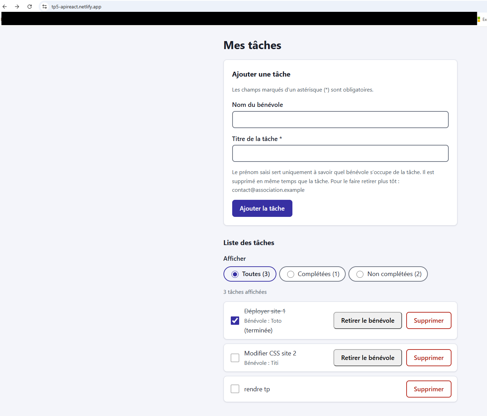

# TP5-Ekod

Mes tâches : gestion de tâches pour bénévoles

Application web permettant à une association de suivre ses tâches et de savoir quel bénévole s'en occupe. Elle permet d'ajouter une tâche, de la marquer comme terminée, de la filtrer, de retirer le bénévole qui lui est associé, ou de la supprimer.

Projet réalisé dans le cadre du TP5. L'interface est conçue pour être accessible (labels associés, navigation au clavier, annonces pour lecteurs d'écran, lien d'évitement).

- Frontend (Netlify) : https://tp5-apireact.netlify.app/  
- API (Fly.io) : https://tp-5-interfacereact.fly.dev/  


Test Lighthouse localhost :


Test Lighthouse site déployé :


## Technologies

- React + Vite (frontend, dossier `frontend/`)
- Node.js + Express (API REST, à la racine)
- PostgreSQL (Docker en local, Supabase en production)
- Docker / Docker Compose, Fly.io (API), Netlify (frontend)
- ESLint

## Structure du projet

```
TP5/
├── app.js                  # API Express
├── Dockerfile              # image de l'API
├── docker-compose.yml      # services api + db
├── init.sql                # création de la table tasks
├── .env                    # variables de l'API (non versionné)
└── frontend/
    ├── .env                # VITE_API_URL (non versionné)
    └── src/App.jsx
```

## Lancer le projet en local

### Prérequis

- Node.js (version 20 ou plus)
- Docker Desktop
- Git

### 1. Récupérer le projet

```bash
git clone https://github.com/Gwladyslsn/TP-5-InterfaceReact
cd TP5
```

### 2. Configurer les variables d'environnement

Créer un fichier `.env` à la racine (API et base de données) :

```dotenv
DB_HOST=<votre_db_host>
DB_PORT=5432
DB_NAME=<nom-de-la-base>
DB_USER=<utilisateur>
DB_PASSWORD=<mot-de-passe>
CORS_ORIGIN=http://localhost:5173
```

Créer un fichier `.env` dans `frontend/` :

```dotenv
VITE_API_URL=http://localhost:3000
```

Adapter les valeurs à votre `docker-compose.yml`. Aucun de ces fichiers ne doit être envoyé sur Git.

### 3. Démarrer l'API et la base de données

À la racine du projet :

```bash
docker compose up -d --build
```

Au premier démarrage, `init.sql` crée la table `tasks`. L'API est alors disponible sur http://localhost:3000/tasks.

### 4. Démarrer le frontend

Dans un second terminal :

```bash
cd frontend
npm install
npm run dev
```

Ouvrir http://localhost:5173.

Si vous utilisez ESLint avec le plugin d'accessibilité :

```bash
npm install -D eslint-plugin-jsx-a11y --legacy-peer-deps   # si conflit de peer dependencies avec ESLint 10
```

### Ports utilisés

| Service | Adresse |
|---|---|
| Frontend (Vite) | http://localhost:5173 |
| API (Express) | http://localhost:3000 |
| PostgreSQL | localhost:5432 |

Le frontend doit être ouvert sur `http://localhost:5173` exactement : c'est la seule origine autorisée par CORS (`CORS_ORIGIN`).

## Commandes utiles

### Frontend (dans `frontend/`)

| Commande | Rôle |
|---|---|
| `npm run dev` | Lance le serveur de développement |
| `npm run build` | Génère la version de production dans `dist/` |
| `npm run lint` | Analyse le code |

### Docker (à la racine)

| Commande | Rôle |
|---|---|
| `docker compose up -d --build` | Construit et démarre l'API et la base |
| `docker compose ps` | Affiche l'état des services |
| `docker compose logs api` | Affiche les logs de l'API |
| `docker compose down` | Arrête les services (données conservées) |
| `docker compose down -v` | Arrête et supprime les données : `init.sql` est rejoué au prochain démarrage |

## Déploiement

### Base de données (Supabase)

Exécuter `init.sql` dans le SQL Editor de Supabase. Utiliser l'hôte du **Session pooler** et l'utilisateur `postgres.<ref-projet>`.

### API (Fly.io)

```bash
fly auth login
fly secrets set DB_HOST=<hôte-pooler> DB_PORT=5432 DB_USER=postgres.<ref-projet> DB_PASSWORD=<mot-de-passe> DB_NAME=postgres DB_SSL=true CORS_ORIGIN=https://<votre-site>.netlify.app -a tp-5-interfacereact
fly deploy -a tp-5-interfacereact
```

Les secrets ne sont jamais écrits dans `fly.toml`.

### Remarque sur l'hébergement Fly.io (compte d'essai)

L'API tourne sur un compte d'essai Fly.io sans carte bancaire : la machine est automatiquement arrêtée après 5 minutes. Elle se rallume seule à la première requête, ce qui peut prendre 3 à 5 secondes. Au premier chargement du site, la liste peut donc mettre un peu de temps à s'afficher ou afficher une erreur : il suffit de recharger la page.

Si l'API ne répond toujours pas, démarrer la machine manuellement :

```bash
fly machine list -a tp-5-interfacereact
fly machine start <id-machine> -a tp-5-interfacereact
```

Pour tester que l'API est en ligne : https://tp-5-interfacereact.fly.dev/tasks  


### Frontend (Netlify)

| Paramètre | Valeur |
|---|---|
| Base directory | `frontend` |
| Build command | `npm run build` |
| Publish directory | `frontend/dist` |
| Variable d'environnement | `VITE_API_URL=https://tp-5-interfacereact.fly.dev` (sans `/` final) |

`VITE_API_URL` est intégrée au build : après toute modification, relancer un déploiement.


## Données de l'API

Chaque tâche contient :

| Champ | Description |
|---|---|
| `id` | Identifiant de la tâche |
| `titre` | Titre de la tâche (obligatoire) |
| `assignee` | Prénom du bénévole assigné (facultatif) |
| `complété` | Indique si la tâche est terminée |

## Questions

### Pourquoi aucune variable `VITE_` ne contient de secret ?

Vite injecte les variables préfixées `VITE_` dans le bundle JavaScript au moment du build. Le code est ensuite envoyé au navigateur : n'importe qui peut le lire (onglet Sources, outils de développement). Une variable `VITE_` est donc publique par nature. Les secrets (mot de passe de la base, clés d'API) restent côté serveur, dans des variables d'environnement (secrets Fly.io, fichier `.env` ignoré par Git), et ne sont jamais préfixés `VITE_`.

### Pourquoi la validation du frontend ne suffit pas ?

La validation côté client améliore l'expérience (retour immédiat à l'utilisateur), mais elle est contournable : on peut modifier le code dans le navigateur, désactiver le JavaScript ou appeler l'API directement (curl, Postman) sans passer par l'interface. Le serveur ne doit donc jamais faire confiance aux données reçues : il revalide tout (types, longueurs, formats) et utilise des requêtes paramétrées pour se protéger des injections SQL.

### Pourquoi l'application n'a pas besoin de bandeau cookies ?

L'application ne dépose aucun cookie ni traceur non essentiel : pas de publicité, pas d'analytics, pas de suivi tiers. Le consentement n'est exigé que pour ces traceurs. Les données strictement nécessaires au fonctionnement (par exemple une session d'authentification) sont exemptées de consentement.

## Protection des données personnelles

### Finalité

Le prénom d'un bénévole est enregistré uniquement pour savoir qui s'occupe de quelle tâche au sein de l'association. Il n'est utilisé à aucune autre fin (pas de statistiques, de prospection ni de partage avec des tiers).

### Données collectées

- Le prénom (ou nom) du bénévole, saisi librement dans le champ « Nom du bénévole » (colonne `assignee`).
- Aucune autre donnée personnelle n'est demandée : pas d'adresse e-mail, de téléphone ni de compte utilisateur.
- Le champ est facultatif : une tâche peut être créée sans bénévole.

### Durée de conservation

Le prénom est conservé tant que la tâche existe, et supprimé en même temps qu'elle. Il peut être effacé plus tôt à tout moment, via le bouton « Retirer le bénévole » ou sur demande du bénévole.

### Accès aux données

- Les membres de l'association qui utilisent l'application (consultation et modification).
- La ou les personnes qui administrent l'API et la base de données (accès technique).
- Aucune transmission à des tiers.

### Droits des bénévoles et exercice

Conformément au RGPD, chaque bénévole peut :

- accéder aux données qui le concernent ;
- faire rectifier son prénom s'il est erroné ;
- demander l'effacement de son prénom (droit à l'effacement) ;
- s'opposer au traitement ou en demander la limitation.

Pour exercer ces droits, il suffit d'écrire à <adresse-réelle>. La demande est traitée dans un délai maximum d'un mois. Un responsable de l'association peut aussi retirer immédiatement le prénom depuis l'application avec le bouton « Retirer le bénévole ». En cas de difficulté, une réclamation peut être adressée à la CNIL (www.cnil.fr).